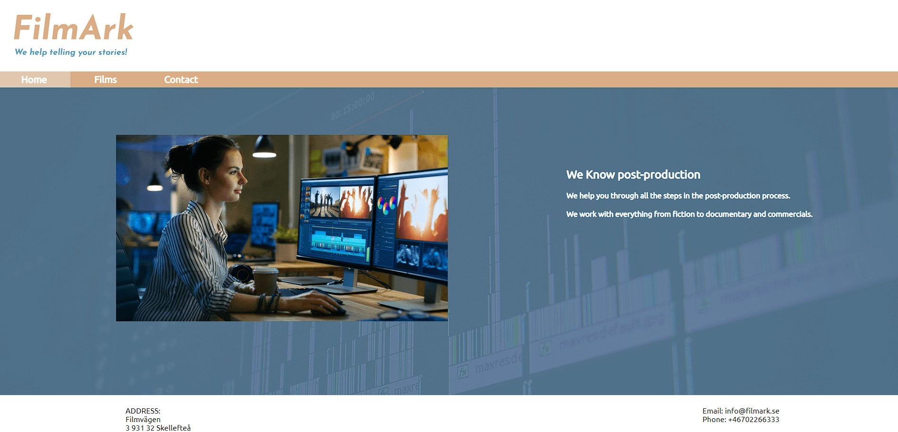
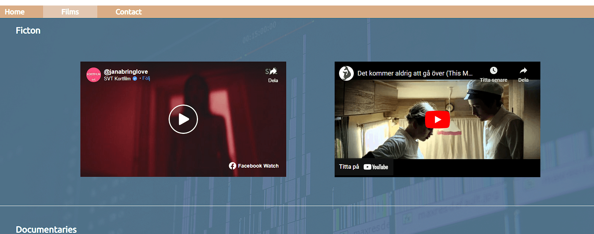
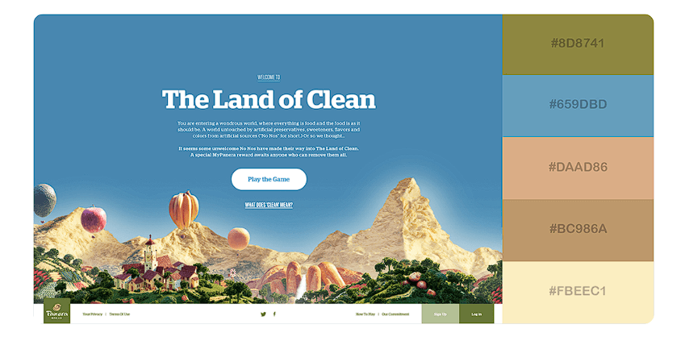

# Film Ark webpage

The Film Ark webpage is a way to attract film makers to use the Film Ark company's post-production services. Here potential clients can look at what the company's previous work, as well as find information on how to contact the company. 

## Features
All pages have a company logo on that has a underneath menu leading to the 3 pages: Home, Films and Contact . The page we are currently on is highlighted. This helps the user navigate back and forth between pages.
There is a footer at the bottom of each page with the address and contact information to Film Ark.
The index page has a picture of a woman editing film along with some short information about what the company does. This immediately gives the user an idea of what type of services that are offered at the page.

The webpage has a page with films that the company has made. This is a way the give credibility to the business, and works as a type of CV. It also shows what type of editing style the company has.
To simplify the step to get in touch with Film Ark there is also a contact page with a form where users can send a message without opening an e-mail application.

### Features left to implement</h4>
The web page could benefit from a page with more thorough information on what type of services the company can offer.

## Testing
I have run through the project with W3C validator and (Jigsaw) validator. I have also checked different sizes with the help from Chrome Inspect tool. I have tried the links in the menu and filled in and submitted a message in the form.

### Unfixed bugs
There are some problems with the film links in the films page according to W3C validator. There is a frameborder="0" and width and height that comes with the links collected from Youtube/Facebook. Removing the frameborder creates a border around the film that doesn't look very nice. Removal of width/height seem to cause the films sizes to change. I haven't found a way to correct this with html or CSS. If it had been a real company site it would probably be better to upload films for the web page

<h3>Deployment</h3>

## Credits 
Still images in this project have been downloaded from: https://pixabay.com/
I have used two film links uploaded on my own Youtube user profil. I have also used clips from 2 films, one from Youtube and one to Facebook, that I have been involved in the making of. I did this to avoid using film links that might have some royalty issues.
I got advice from my mentor, Jubril Akolade, regarding the use of flexbox and got help from watching a tutorial from Youtube: https://www.youtube.com/playlist?list=PL4cUxeGkcC9i3FXJSUfmsNOx8E7u6UuhG
I used this page to find a color scheme for my homepage: https://visme.co/blog/website-color-schemes/.
I used the colors from number 3 as inspiration, but choose to use a somewhat colder version of the blue. 

I used the codes #DAAD86 and #659dbd.
